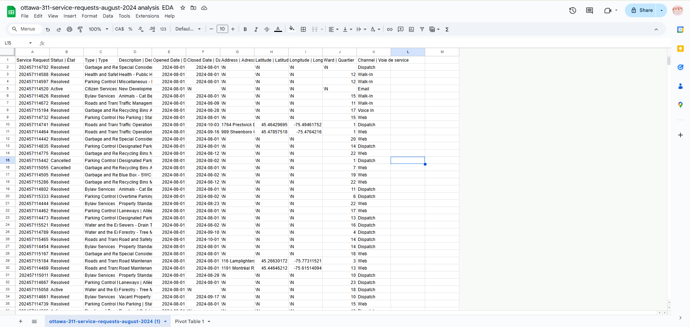
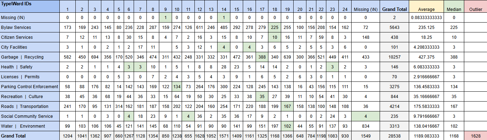
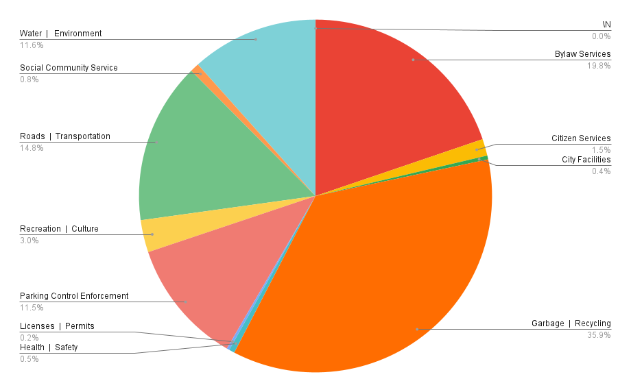
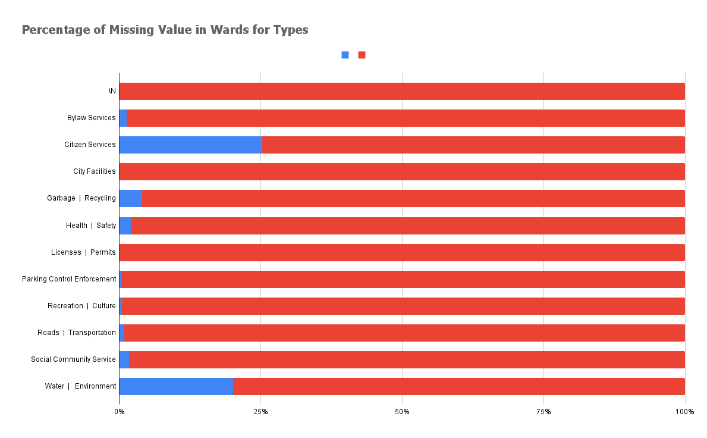
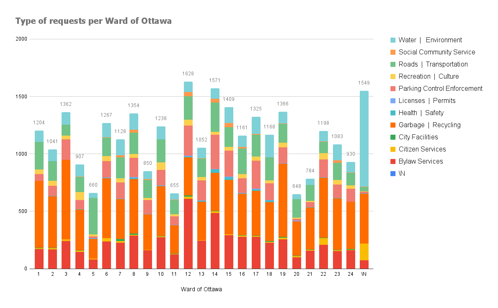
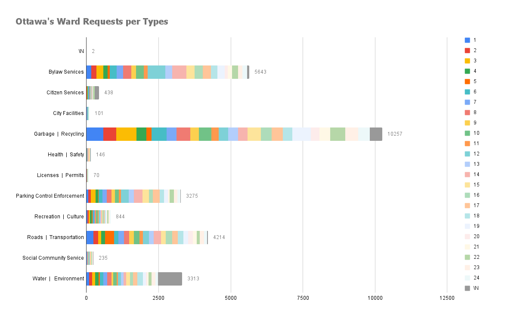

**2024/10/30**<br>
**Mpad 2003 Data Storytelling**<br>
**Maxine Zeng**<br>
**Presented to Jean-Sébastien Marier**<br>

# Midterm Project: Exploratory Data Analysis (EDA)

<!-- Use one hashtag symbol (`#`) to create a level 1 heading like this one. -->

## Foreword

This data exploratory analysis focus on learning objectives of data storytelling:

`1.` Import, cleaning data from scratch
`2.` Learning basics of github 
`3.` Learning how to write markdown files

<!-- For this assignment, you must extract data from a dataset provided by the instructor. You must then clean and analyze the data, create exploratory charts/visualizations, and find a potential story idea. Your assignment must clearly detail your process. You are expected to write about 1500-2000 words, and to include several screen captures showing the different steps you went through. Your assignment must be written with the Markdown format and submitted on GitHub Classroom.

I have been assigning different versions of this project to my digital journalism and data storytelling students for a few years now. Its structure was inspired by the main sections/chapters of [*The Data Journalism Handbook*](https://datajournalism.com/read/handbook/one/). This version was further inspired by the [Key Capabilities in Data Science](https://extendedlearning.ubc.ca/programs/key-capabilities-data-science) program offered by the University of British Columbia (UBC).

**Here are some useful resources for this assignment:**

* [GitHub's *Basic writing and formatting syntax* page](https://docs.github.com/en/get-started/writing-on-github/getting-started-with-writing-and-formatting-on-github/basic-writing-and-formatting-syntax)
* [The template repository for this assignment in case you delete something by mistake](https://github.com/jsmarier/jou4100_jou4500_mpad2003_project2_template)

Did you notice how to create a hyperlink? In Markdown, we put the clickable text between square brackets and the actual URL between parentheses.

And to create an unordered list, we simply put a star (`*`) before each item. -->

## 1. Introduction

This exploratory data analysis will be analyzing the City of Ottawa dataset of citizen requests.
The City of Ottawa receives requests from four sources: 311 contact centre, client service centre, 311 email and web-based self- service portal. Which includes content such as Bylaw Services, Citizen Services, City Facilities and Garbage and Recycling, etc. They collected these requests and documented each one of them down into a dataset. The dataset is updating daily.
This analysis will including sections of getting data, understanding data, potential story, conclusion and references list.

* [Link to the original dataset from City of Ottawa (updating daily):](https://open.ottawa.ca/documents/65fe42e2502d442b8a774fd3d954cac5/about)

* [Link to the csv version I used.](https://raw.githubusercontent.com/jsmarier/course-datasets/refs/heads/main/ottawa-311-service-requests-august-2024.csv)


## 2. Getting Data

First, I download the data from the github link assigned with a shortcut Ctrl + S, place it under my github folder. Then open google sheet, select tab "file", then "import", upload the file from saved location.


<br>
*Figure 1: The imported dataset in Google Sheets.*

* [Link to my dataset imported in Google Sheets](https://docs.google.com/spreadsheets/d/1mhltDAwbRGIJIhvvtqf18TT1oe3h3seDmpCdTad6e7E/edit?usp=sharing)

From A to K, there are 11 columns and 28539 row of data for each individual cases. Apparently, the original dataset is quite overwhelming for analyzing. The data looks to be clean and well structured, but it can still benefit from some modification for a clear readability. Also noticed that "\N" is being used to label missing value.

`1. ` Column A "Service Request ID | Numéro de demande" contains numerical ordinal ID numbers, which are all unique to its own case.

`2. ` Column B "Status | État" contains categorical data, which only has "Resolved", "Cancelled" and "Active" as input.

`3. ` Column C "Type | Type" is categorical data defining the request under a big category. It has 11 categories in total.

`4. ` Column D "Description | Description" Contains 554 sub category data under each big category.

`5. ` Column E "Opened Date | Date d'ouverture" and Column F "Closed Date | Date de fermeture" are ordinal date data, there will always be a specific opened data on column e, but Column F can be mark as "/N" because it is not resolved.

`6.` Column G "Address | Adresse" includes text information of address. A lot of them were marked as "\N".

`7.` Column H "Latitude | Latitude" and I "Longitude | Longitude" are discrete data indicating the coordinate of the address. Can be marked as "\N" with address

`8. ` Column J "Ward | Quartier" is 24 categorical data of the ID of wards in Ottawa, but some of them were marked as "\N" as the 25th category. The ID of wards makes the data cleaner and easier to use compare to data record with ward names, which may have different versions.

`9. ` Column K "Channel | Voie de service" is categorical data of how the case being requested, there are 6 category in total.

After understanding the data, I wonder if there is a correlation between wards and type categories of issues.


<!-- Use two hashtag symbols (`##`) to create a level 2 heading like this one.

To include a screen capture, use the sample code below. Your images should be saved in the same folder as your `.md` file.

<br>
*Figure 1: The "Import file" prompt on Google Sheets.*

**Here are examples of functions and lines of code put in grey boxes:**

1. If you name a function, put it between "angled" quotation marks like this: `IMPORTHTML`.
1. If you want to include the entire line of code, do the same thing, albeit with your entire code: `=IMPORTHTML("https://en.wikipedia.org/wiki/China"; "table", 5)`.
1. Alternatively, you can put your code in an independent box using the template below:

``` r
=IMPORTHTML("https://en.wikipedia.org/wiki/China"; "table", 5)
```
This also shows how to create an ordered list. Simply put `1.` before each item. -->

## 3. Understanding Data

### 3.1. VIMO Analysis

This VIMO Analysis is focusing on Column C Type, Column D Description and Column J Ward Columns:

`1. `Valid: 
    All data are valid under each category except for the missing ones marked as "\N". They are identify as Micro data, which are summarized into a big category.

`2. `Invalid: 
    No data seems to be Invalid.
    
`3. `Missing: 
    Missing values are marked as "\N".
    There are 1549 rows of data is being marked as "\N" under column of wards. 
    There are 628 rows are being marked as "\N" under column Description
    There are 2 rows of data being marked as "\N" under column of types.

`4.`Outlier: 
    I noticed that for Water and the Environment there are 834 row of data being marked as missing, that is the highest among other types. This problem could be due to location ambiguity, which some issues location were not clearly defined within ward boundaries or have cross ward boundaries, leading to reporting confusions. 

<!-- Import an images of the charts and visualization -->


<!-- Use three hashtag symbols (`###`) to create a level 3 heading like this one. Please follow this template when it comes to level 1 and level 2 headings. However, you can use level 3 headings as you see fit.

Insert text here.

Support your claims by citing relevant sources. Please follow [APA guidelines for in-text citations](https://apastyle.apa.org/style-grammar-guidelines/citations).

**For example:**

As Cairo (2016) argues, a data visualization should be truthful... -->

### 3.2. Cleaning Data

To clean the data, I duplicated the original dataset into a new sheet, then I hided most of the columns except the three columns (Type, Description and Ward) that I needed. Then I removed all the french labels after the divider for each column on first row. Next, I selected the first row and then used freeze in view tab, now the first row will stay on top of when I scroll down. Then I sorted the data from A to Z in Type column.

For the Type column, I found all the "and" using the find functions with Ctrl F, the replace all of them to a divider " | ", resulting a shorter value for each row with more clear readability. Then I removed all of "the" for the same purpose.

For the description tab, I placed spilt functions `(=SPLIT(D2, "|"))` to split the french description to two extra columns. Then I copy the value in the English description column then Ctrl + Shift + V to copy plain text only to get rid of the split formula. Then deleted the french description column and the original one.                 

I further split the description tab with `=SPLIT(D2, "-")`, which splits it into 3 columns. Then I copy and pasted the three column as plain values, then I rejoin the last two columns together with `=CONCATENATE(F2," ", G2)`. The concatenate column is named as Sub description, which is useful for looking at data within a smaller range then the original Description categories. Then I used the trim white space tool under the data cleaning of Google onto the new Description and Sub Description column.

### 3.3. Exploratory Data Analysis (EDA)

The cleaned dataset now only includes four column, Type, Description, Sub Description and Ward. Which I can used to see patterns of the issues between wards.

A pivot table was created to analysis the relationship between Wards and Type. Which only contains nominal variables. The table is also an ordinal level of measurement with these following requirements met(TouhidulIslam, 2021):
    `1. ` The data classifications of the columns are mutually exclusive and exhaustive.
    `2. ` The data can be meaningfully ranked by its number, from low to high. 

* [Levels of Measurement (Nominal, Ordinal, Interval, Ratio) in Statistics] (https://www.datasciencecentral.com/levels-of-measurement-nominal-ordinal-interval-ratio-in/)

In the pivot table, I also calculated the mean of all Types using `=DIVIDE(AA2, 24)`, and the median with `=MEDIAN((B2:Z2))`. The average of Requests between 24 wards is approximately 1190 per ward. The highest one is ward 12 Rideau-Vanier with 1628 request and Ward 20 Osgoode with 648 requests, the median is 1168 requests from ward 18 Cumberland. 

<br>
*Figure 2: This pivot table shows the relationship between Ward and Type*

Based on the pivot table,  I created a few simple visualizations in Google sheets. In the graph visualizing type of requests per Ward on figure 3, the Garbage and Cleaning category in orange is the most common value. It can also be marked as significant data since it went over 30% of the data.

* [Interpretation of VIMO table](https://umanitoba.ca/manitoba-centre-for-health-policy/sites/manitoba-centre-for-health-policy/files/2021-11/vimo-table-interpretation.pdf)

In the second visualization in figure 4, you can also spot the outlier that was found earlier, which is from Water and Environment that are on the column for requests's ward being marked as missing. 

<br>
*Figure 3: Percentage of Types*

I further dived into the missing value in percentage, Citizen Service has 25.3% ward information missing and Water and Environment has 20.1% percentage missing. These two are the only ones that is significantly higher than others.

<br>
*Figure 4: Percentage of Types*

The Licenses | Permit rows are most rare two requests among all the categorical, which is not surprising, but Health | Safety row being the second least seems to be odd. 

Covariations happened between the number of the types and the total number of requests per ward. For example, ward 12 Rideau-Vanier has the highest total number (1628) and the most Bylaw Services (611) request at the same time. Ward 20 Osgoode has the fewest number of total number and fewest number of Water Requests. (Wickham 2017)  

* [R for Data Science](https://r4ds.had.co.nz/exploratory-data-analysis.html)

<br>
*Figure 5: This graph visualized the type of request per district*

<br>
*Figure 6: This graph visualized each district's request number in different types*

<!-- **This section should include a screen capture of your pivot table, like so:**

<br>
*Figure 2: This pivot table shows...*

**This section should also include a screen capture of your exploratory chart, like so:**

<br>
*Figure 3: This exploratory chart shows...* -->

## 4. Potential Story

A potential story in my analysis can be sharing which ward in Ottawa is the most habitable and safe, by analyzing which ward has less issues. For example we can create a heat map using the ward map of Ottawa, using the color red to indicate which wards are tend to be problematic. 

This story can be further narrowed down targeting a certain group, for example the analysis can focus on elders. Then we can focus on the Roads and Transportation, Health and safety, and Bylaw services. If a district has high amount of noise complaints under bylaw services, poor road management, and active health concerns, it will be identify as less suitable for elders to live in there.

An example of this type of data storytelling, CTV Ottawa reported noise issue in 2015 ward by ward. The former bylaw Chief Roger Chapman claimed that the most popular noise complaints they received are loud musics, construction noises and machine noises, anything above 50 db is consider violation. The top 1 complaint ward is 12 Rideau Vanier. (CTV Ottawa 2015)

* [What's all the noise? A ward-by-ward breakdown of noise complaints in Ottawa](https://ottawa.ctvnews.ca/what-s-all-the-noise-a-ward-by-ward-breakdown-of-noise-complaints-in-ottawa-1.2431535)

For further information onto my topic, it would be a great help to interview the current city Councillors of Ottawa or bylaw chief, and the local residents who are currently experiencing the issues. 


## 5. Conclusion

The most challenging part of this assignment is managing to clean the data itself. For a large dataset containing all most 30k rows of data, it is a heavy loaded work for my laptop to process, it glitched and crushed the browser for a few times. Reflecting on this experiencing, I recognized that I needed to narrow down my study to a smaller range with a more focused topic. Thus it would provided me with a lighter data handling.   

On the other hand, the rewarding aspect came after the data cleaning when I created the visualizations. Seeing the data table and visualization turn out to be clear and readable for data storytelling, which all the efforts on the data before them seen well worth it.  

Besides from the the data processing part, I also identified my knowledge gap on analysing the data, I needed to revisit course readings and research for additional resources online to learn and reference how to write more effective exploratory data analysis. Acquiring the new skills for telling a compelling story through data and data visualization made the project feel worthwhile.

In summary, this assignment has been a practice with challenges an rewards, emphasizing the importance of data cleaning and efficiency of data storytelling. 

## 6. References

City of Ottawa. (n.d.). 2024 service requests. Open Ottawa. * [https://open.ottawa.ca/documents/65fe42e2502d442b8a774fd3d954cac5/about](https://open.ottawa.ca/documents/65fe42e2502d442b8a774fd3d954cac5/about)

TouhidulIslam, M. (2021, February 25). Levels of measurement (nominal, ordinal, interval, ratio) in statistics. Data Science Central.  * [Levels of Measurement (Nominal, Ordinal, Interval, Ratio) in Statistics](https://www.datasciencecentral.com/levels-of-measurement-nominal-ordinal-interval-ratio-in/)

Interpretation of vimo table. (2015, March 27). * [https://umanitoba.ca/manitoba-centre-for-health-policy/sites/manitoba-centre-for-health-policy/files/2021-11/vimo-table-interpretation.pdf ](https://umanitoba.ca/manitoba-centre-for-health-policy/sites/manitoba-centre-for-health-policy/files/2021-11/vimo-table-interpretation.pdf)

Wickham , H., & Grolemund, G. (2017). R for data science. 7 Exploratory Data Analysis.  * [https://r4ds.had.co.nz/exploratory-data-analysis.html](https://r4ds.had.co.nz/exploratory-data-analysis.html)

CTV Ottawa. (2015, June 19). What’s All the noise? A ward-by-ward breakdown of noise complaints in Ottawa.  * [https://ottawa.ctvnews.ca/what-s-all-the-noise-a-ward-by-ward-breakdown-of-noise-complaints-in-ottawa-1.2431535](https://ottawa.ctvnews.ca/what-s-all-the-noise-a-ward-by-ward-breakdown-of-noise-complaints-in-ottawa-1.2431535)

<!-- Include a list of your references here. Please follow [APA guidelines for references](https://apastyle.apa.org/style-grammar-guidelines/references). Hanging paragraphs aren't required though.

**Here's an example:**

Bounegru, L., & Gray, J. (Eds.). (2021). *The Data Journalism Handbook 2: Towards A Critical Data Practice*. Amsterdam University Press. [https://ocul-crl.primo.exlibrisgroup.com/permalink/01OCUL_CRL/hgdufh/alma991022890087305153](https://ocul-crl.primo.exlibrisgroup.com/permalink/01OCUL_CRL/hgdufh/alma991022890087305153) -->
