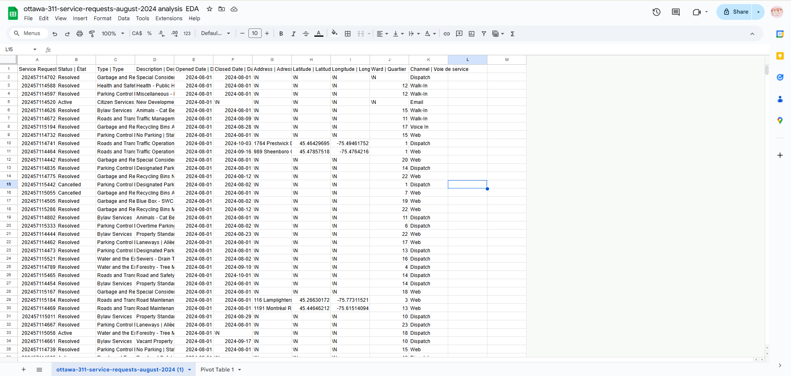

**2024/10/30**<br>
**Mpad 2003 Data Storytelling**<br>
**Maxine Zeng**<br>
**Presented to Jean-Sébastien Marier**<br>

# Midterm Project: Exploratory Data Analysis (EDA)

<!-- Use one hashtag symbol (`#`) to create a level 1 heading like this one. -->

## Foreword

This data exploratory analysis focus on learning objectives of data storytelling:

`1.` Import, cleaning data from scratch
`2.` Learning basics of github 
`3.` Learning how to write markdown files

<!-- For this assignment, you must extract data from a dataset provided by the instructor. You must then clean and analyze the data, create exploratory charts/visualizations, and find a potential story idea. Your assignment must clearly detail your process. You are expected to write about 1500-2000 words, and to include several screen captures showing the different steps you went through. Your assignment must be written with the Markdown format and submitted on GitHub Classroom.

I have been assigning different versions of this project to my digital journalism and data storytelling students for a few years now. Its structure was inspired by the main sections/chapters of [*The Data Journalism Handbook*](https://datajournalism.com/read/handbook/one/). This version was further inspired by the [Key Capabilities in Data Science](https://extendedlearning.ubc.ca/programs/key-capabilities-data-science) program offered by the University of British Columbia (UBC).

**Here are some useful resources for this assignment:**

* [GitHub's *Basic writing and formatting syntax* page](https://docs.github.com/en/get-started/writing-on-github/getting-started-with-writing-and-formatting-on-github/basic-writing-and-formatting-syntax)
* [The template repository for this assignment in case you delete something by mistake](https://github.com/jsmarier/jou4100_jou4500_mpad2003_project2_template)

Did you notice how to create a hyperlink? In Markdown, we put the clickable text between square brackets and the actual URL between parentheses.

And to create an unordered list, we simply put a star (`*`) before each item. -->

## 1. Introduction

This exploratory data analysis will be analyzing the City of Ottawa dataset of citizen requests.
The City of Ottawa receives requests from four sources: 311 contact centre, client service centre, 311 email and web-based self- service portal. Which includes content such as Bylaw Services, Citizen Services, City Facilities and Garbage and Recycling, etc. They collected these requests and documented each one of them down into a dataset. The dataset is updating daily.
This analysis will including sections of getting data, understanding data, potential story, conclusion and references list.

* [Link to the original dataset from City of Ottawa (updating daily):](https://open.ottawa.ca/documents/65fe42e2502d442b8a774fd3d954cac5/about)

* [Link to the csv version I used.](https://raw.githubusercontent.com/jsmarier/course-datasets/refs/heads/main/ottawa-311-service-requests-august-2024.csv)


## 2. Getting Data

First, I download the data from the github link assigned with a shortcut Ctrl + S, place it under my github folder. Then open google sheet, select tab "file", then "import", upload the file from saved location.


<br>
*Figure 1: The imported dataset in Google Sheets.*

* [Link to my dataset imported in Google Sheets](https://docs.google.com/spreadsheets/d/1mhltDAwbRGIJIhvvtqf18TT1oe3h3seDmpCdTad6e7E/edit?usp=sharing)

From A to K, there are 11 columns and 28539 row of data for each individual cases. Apparently, the original dataset is quite overwhelming for analyzing. The data looks to be clean and well structured, but it can still benefit from some modification for a clear readability. Also noticed that "\N" is being used to label missing value.

`1. ` Column A "Service Request ID | Numéro de demande" contains numerical ordinal ID numbers, which are all unique to its own case.

`2. ` Column B "Status | État" contains categorical data, which only has "Resolved", "Cancelled" and "Active" as input.

`3. ` Column C "Type | Type" is categorical data defining the request under a big category. It has 11 categories in total.

`4. ` Column D "Description | Description" Contains 554 sub category data under each big category.

`5. ` Column E "Opened Date | Date d'ouverture" and Column F "Closed Date | Date de fermeture" are ordinal date data, there will always be a specific opened data on column e, but Column F can be mark as "/N" because it is not resolved.

`6.` Column G "Address | Adresse" includes text information of address. A lot of them were marked as "\N".

`7.` Column H "Latitude | Latitude" and I "Longitude | Longitude" are discrete data indicating the coordinate of the address. Can be marked as "\N" with address

`8. ` Column J "Ward | Quartier" is 24 categorical data of the ID of wards in Ottawa, but some of them were marked as "\N" as the 25th category. The ID of wards makes the data cleaner and easier to use compare to data record with ward names, which may have different versions.

`9. ` Column K "Channel | Voie de service" is categorical data of how the case being requested, there are 6 category in total.

After understanding the data, I wonder if there is a correlation between wards and type categories of issues.


<!-- Use two hashtag symbols (`##`) to create a level 2 heading like this one.

To include a screen capture, use the sample code below. Your images should be saved in the same folder as your `.md` file.

<br>
*Figure 1: The "Import file" prompt on Google Sheets.*

**Here are examples of functions and lines of code put in grey boxes:**

1. If you name a function, put it between "angled" quotation marks like this: `IMPORTHTML`.
1. If you want to include the entire line of code, do the same thing, albeit with your entire code: `=IMPORTHTML("https://en.wikipedia.org/wiki/China"; "table", 5)`.
1. Alternatively, you can put your code in an independent box using the template below:

``` r
=IMPORTHTML("https://en.wikipedia.org/wiki/China"; "table", 5)
```
This also shows how to create an ordered list. Simply put `1.` before each item. -->

## 3. Understanding Data

### 3.1. VIMO Analysis

This VIMO Analysis is focusing on the Type and Ward Columns:

`1. `Valid
    All data are valid under each category except for the missing ones marked as "\N". They are identify as Micro data, which are summarized into a big category.

`2. `Invalid
    No data is Invalid.
    
`3. `Missing
    There are 1549 rows of data is being marked as "\N" under column of wards. 
    There are 2 rows of data being marked as "\N" under column of types.

`4.`Outlier
    I noticed that for Water and the Environment there are 834 row of data being marked as missing, that is the highest among other types. This problem could be due to location ambiguity, which some issues location were not clearly defined within ward boundaries or have cross ward boundaries, leading to reporting confusions. 


<!-- Use three hashtag symbols (`###`) to create a level 3 heading like this one. Please follow this template when it comes to level 1 and level 2 headings. However, you can use level 3 headings as you see fit.

Insert text here.

Support your claims by citing relevant sources. Please follow [APA guidelines for in-text citations](https://apastyle.apa.org/style-grammar-guidelines/citations).

**For example:**

As Cairo (2016) argues, a data visualization should be truthful... -->

### 3.2. Cleaning Data

Insert text here.

### 3.3. Exploratory Data Analysis (EDA)

Insert text here.

**This section should include a screen capture of your pivot table, like so:**

<br>
*Figure 2: This pivot table shows...*

**This section should also include a screen capture of your exploratory chart, like so:**

<br>
*Figure 3: This exploratory chart shows...*

## 4. Potential Story

Insert text here.

## 5. Conclusion

Insert text here.

## 6. References

Include a list of your references here. Please follow [APA guidelines for references](https://apastyle.apa.org/style-grammar-guidelines/references). Hanging paragraphs aren't required though.

**Here's an example:**

Bounegru, L., & Gray, J. (Eds.). (2021). *The Data Journalism Handbook 2: Towards A Critical Data Practice*. Amsterdam University Press. [https://ocul-crl.primo.exlibrisgroup.com/permalink/01OCUL_CRL/hgdufh/alma991022890087305153](https://ocul-crl.primo.exlibrisgroup.com/permalink/01OCUL_CRL/hgdufh/alma991022890087305153)
